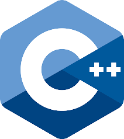

<h1 align="center">Olá! Meu nome é Éric 👨‍💻☕</h1> 

<h3 align="start">Tenho 26 anos, moro em Jequié/BA e sou fascinado pelo desenvolvimento de lógica de programação.</h3>

- 🎓 Graduando em Sistemas de Informação pela [UESB](https://www.uesb.br/).

***

🛠 Tecnologias e Ferramentas

### _Linguagens_

    

### _Front-end_

<a href="https://reactjs.org/" target="_blank">    
 
### _Back-end_

 

### _Banco de Dados_
  

### _Ferramentas_

#

<h3 align="left">Conecte-se comigo:</h3>

 ### Here is a random joke that'll make you laugh!
 
